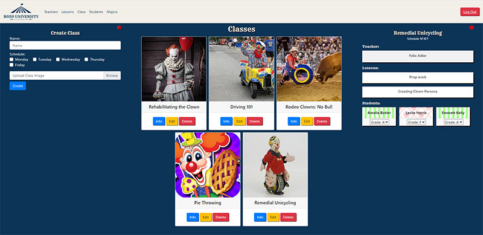
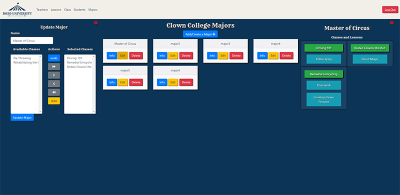

# NSS E12  Group Exercise

## Description:
The objective of the group project was to create an admin dashboard for Bozo University. The app features full CRUD and uses join tables to allow all data to interact. Project data and hosting via Firebase.

## Clowns (Bozo University Dev Team): 
1. Michael Dotson
1. Matt Logan
1. Nate Owens
1. Nick Walters

## Features:
1. Full CRUD on Teachers/Lessons/Classes/Students/Majors
1. Teachers/Students/Lessons can be added to a class. Or removed from a class.
1. Classes can be added to a major.
1. Classes display all information.
1. Majors display all information.
1. Dual select forms to add/remove teachers, students, lessons.
1. Students can be assigned a grade in each class they are in.

## Screenshots:
##### Class Details

##### Major Details
